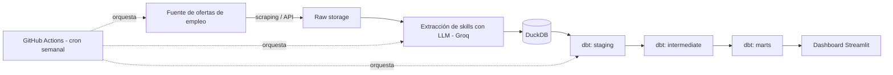

# Arquitectura

## Visión general

DevRadar es un pipeline ELT (Extract-Load-Transform) orientado a analizar la demanda de tecnologías en el mercado laboral. Se ha diseñado deliberadamente **sin infraestructura propia**: todos los componentes corren en servicios gestionados o gratuitos, orquestados desde GitHub Actions.

## Diagrama de flujo

## Componentes

### 1. Ingesta (`src/ingest.py`)
Obtiene ofertas de empleo de la fuente configurada (API o scraping respetuoso: `robots.txt`, límite de frecuencia de peticiones, caché en disco para evitar reprocesar ofertas ya vistas). El resultado crudo se guarda tal cual en una tabla `raw_ofertas` de DuckDB, sin transformar, para preservar la trazabilidad del dato original.

### 2. Extracción de entidades con LLM (`src/extract.py`)
Cada oferta pasa por un LLM (Groq por defecto; Ollama local soportado como alternativa para desarrollo offline) con un prompt estructurado que devuelve JSON con:
- Tecnologías mencionadas (normalizadas contra un catálogo controlado)
- Nivel de seniority (junior / mid / senior, si es inferible)
- Modalidad (remoto / híbrido / presencial)
- Rango salarial, si aparece explícito

El resultado se guarda como `raw_ofertas_clasificadas`, manteniendo también el JSON crudo del LLM por si se necesita reprocesar con un prompt mejorado sin volver a llamar a la API.

### 3. Transformación con dbt (`dbt_project/`)

Estructura en tres capas, siguiendo convención estándar de dbt:

- **`staging`** (`stg_ofertas`): limpieza básica — normalización de fechas, deduplicado por ID de oferta, tipado de columnas.
- **`intermediate`** (`int_tecnologias_por_oferta`): "explota" el array de tecnologías detectadas por oferta en una fila por combinación (oferta, tecnología), facilitando agregaciones posteriores.
- **`marts`**:
  - `demanda_tecnologias_mensual`: nº y % de ofertas que mencionan cada tecnología, por mes (el % se calcula sobre las ofertas con al menos una tecnología detectada, ver ADR-007).
  - `salarios_por_tecnologia`: media/mediana salarial cuando el dato existe.
  - `tendencia_modalidad`: evolución de remoto/híbrido/presencial en el tiempo.
  - `cobertura_extraccion_mensual`: ofertas clasificadas y % sin ninguna tecnología detectada, por mes.

### 4. Orquestación (`.github/workflows/pipeline.yml`)
Un workflow de GitHub Actions con `schedule: cron` ejecuta semanalmente, en orden: ingesta → extracción LLM → `dbt run` → `dbt test`. Si algún test de dbt falla, el workflow falla y no se publican los datos nuevos, evitando que el dashboard muestre información inconsistente.

### 5. Visualización (`dashboard/app.py`)
Streamlit lee directamente los marts de DuckDB y expone:
- Ranking de tecnologías más demandadas, filtrable por rango de fechas.
- Evolución temporal de una tecnología concreta.
- Comparativa de modalidad de trabajo y salarios cuando el dato está disponible.

## Modelo de datos (resumen)

| Tabla | Capa | Grano |
|---|---|---|
| `raw_ofertas` | raw | 1 fila = 1 oferta cruda |
| `raw_ofertas_clasificadas` | raw | 1 fila = 1 oferta + JSON del LLM |
| `stg_ofertas` | staging | 1 fila = 1 oferta limpia |
| `int_tecnologias_por_oferta` | intermediate | 1 fila = (oferta, tecnología) |
| `demanda_tecnologias_mensual` | marts | 1 fila = (tecnología, mes) |
| `salarios_por_tecnologia` | marts | 1 fila = (tecnología, mes) |
| `tendencia_modalidad` | marts | 1 fila = (modalidad, mes) |
| `cobertura_extraccion_mensual` | marts | 1 fila = mes |

## Consideraciones de escalabilidad

El volumen esperado (cientos-miles de ofertas/semana) no justifica herramientas de procesamiento distribuido: DuckDB gestiona sin problema varios millones de filas en una sola máquina. Si el volumen creciera significativamente, el punto de migración natural sería sustituir DuckDB por BigQuery o Snowflake manteniendo los mismos modelos dbt (cambio de adaptador, no de lógica).